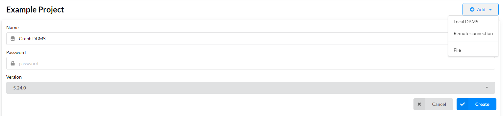

# Picture-Graph-DBMS

基於 Neo4j 圖資料庫與多模態檢索的圖片知識檢索系統。

## 🚀 安裝與執行步驟

### 1. Clone 本專案

```bash
git clone https://github.com/fsdhnwe/Picture-Graph-DBMS.git
cd Picture-Graph-DBMS
```

---

### 2. 建立虛擬環境（Python 版本需 3.10 以上）

建議使用 `venv` 或 `conda`：

使用 venv：
```bash
python -m venv .venv
source .venv/bin/activate      # Linux/macOS
# 或
.venv\Scripts\activate         # Windows
```

使用 conda：
```bash
conda create -n picGraphDBMS python=3.10
conda activate picGraphDBMS
```

---

### 3. 安裝套件依賴

```bash
pip install -r requirements.txt
```

---

### 4. 設定 Neo4j 資料庫

請先安裝並開啟 Neo4j Desktop，並新增一個 **Local DBMS**：



啟動資料庫後，請從圖形介面中確認你的使用者名稱與連線位址，例如：


請將這些資訊填入 `config.py` 中，例如：

```python
# Neo4j 連接設置
NEO4J_URI = "bolt://localhost:7687"
NEO4J_USERNAME = "neo4j"
NEO4J_PASSWORD = "你的密碼"
NEO4J_DATABASE = "neo4j"
```

---

### 5. 設定 HuggingFace API Token

本系統僅會在第一次下載模型使用到 HuggingFace api token，所以請至 [https://huggingface.co/settings/tokens](https://huggingface.co/settings/tokens) 申請 Access Token，並在 `config.ini` 中修改以下欄位：

```python
api_token = 你的 HuggingFace API Token
```

---

### 6. 執行前端介面

請參考 [ui/README.md](./src/ui/README.md) 內說明，或直接執行：

```bash
python run_ui.py
```

---

