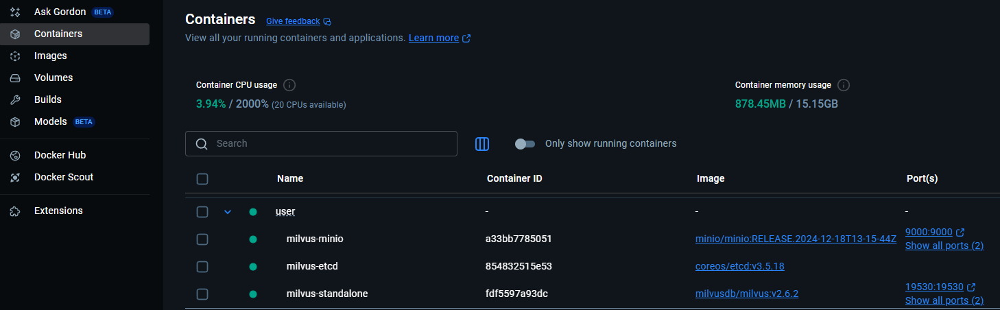

# Picture-Graph-DBMS

基於 Neo4j 圖資料庫與多模態檢索的圖片知識檢索系統。

## 🚀 安裝與執行步驟

### 1. Clone 本專案

```bash
git clone https://github.com/fsdhnwe/Picture-Graph-DBMS.git
cd Picture-Graph-DBMS
```

---

### 2. 建立虛擬環境（Python 版本需 3.10 以上）

建議使用 `venv` 或 `conda`：

使用 venv：
```bash
python -m venv .venv
source .venv/bin/activate      # Linux/macOS
# 或
.venv\Scripts\activate         # Windows
```

使用 conda：
```bash
conda create -n PicDBMS python=3.13.2
conda activate PicDBMS
cd ..
D:
cd d:\PicDBMS
```

---

### 3. 安裝套件依賴

```bash
pip install -r requirements.txt
```

---

### 4. 安裝docker與milvus

請先安裝並開啟 docker：https://www.docker.com/

1.在管理員模式中開啟 Docker Desktop，方法是按滑鼠右鍵並選擇以管理員身分執行。

2.在 PowerShell 或 Windows Command Prompt 執行下列指令，為 Milvus Standalone 下載 Docker Compose 配置檔案，並啟動 Milvus。

```bash
C:\>Invoke-WebRequest https://github.com/milvus-io/milvus/releases/download/v2.6.2/milvus-standalone-docker-compose.yml -OutFile docker-compose.yml

C:\>docker compose up -d
```


啟動資料庫後，可以安裝database的GUI：https://github.com/zilliztech/attu/releases

---

### 6. 執行前端介面

請參考 [ui/README.md](./src/ui/README.md) 內說明，或直接執行：

```bash
python run_ui.py
```

---

